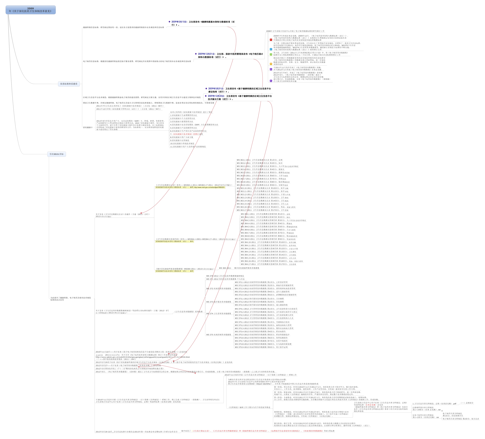

healthcaredatastandard
======================

[TOC]

## 写在前面

本合集原作者 [wanghaisheng](https://github.com/wanghaisheng/) 更新一段时间后停更了，本人出于个人兴趣重新Fork后开始更新。为了和之前的进行区分，我重新建立了两个文件夹：

- 文件夹 `未分类数据集` 是我自己曾经收集的，仅按照文件名排序的卫生标准数据集。
- 文件夹 `分类后数据集及规范` 则是原作者之前收集整理的。

我的想法是，一方面需要保留仅按照顺序排列的卫生标准，另一方面也可以根据原作者的分类，分到不同的文件夹（这个工作量比较大，其实我也怀疑必要性，分得太细是否有必要）。

初次接触本文的我建议首先阅读：

1. `.\分类后数据集及规范\数据类标准\卫统指标` 下的 **卫生资源统计调查数据元提取与标准化研究-第四军医大硕士论文** 这篇硕士论文（原作者 [wanghaisheng]文件名《卫统指标 博士论文》，我打开后发现是硕士论文，遂改为现名）。这篇文章对卫生统计数据做了较好的系统阐述和架构说明。

2. 以及 `.\分类后数据集及规范\数据类标准\数据集标准\试行` 下的 **2-1 《电子病历基本架构与数据标准》-2009** ，此文标准集里的概念做了解释。虽然主要是讲电子病历系统开发的，但是信息标准体系里的概念是互通的，而至少目前我只在这里发现了有对常见概念进行的梳理。如：
   > 电子病历数据结构分为四层：
   >
   > （1）临床文档：位于电子病历数据结构的最顶层，是由特定医疗服务活动（卫生事件）产生和记录的患者（或保健对象）临床诊疗
   > 和指导干预信息的数据集合。如：门（急）诊病历、住院病案首页、会诊记录等。
   >
   > （2）文档段：结构化的临床文档一般可拆分为若干逻辑上的段，即文档段。文档段为构成该文档段的数据提供临床语境，即为其中的数据元通用定义增加特定的约束。结构化的文档段一般由数据组组成，并通过数据组获得特定的定义。**本标准中未明确定义文档段，但隐含了文档段概念**。
   >
   > （3）数据组：由若干数据元构成，作为一个数据元集合体构成临床文档的基本单元，具有临床语义完整性和可重用性特点。数据组
   > 可以存在嵌套结构，即较大的数据组中可包含较小的子数据组。如：文档标识、主诉、用药等。
   >
   > （4）数据元：位于电子病历数据结构的最底层，是可以通过定义、标识、表示和允许值等一系列属性进行赋值的最小、不可再细分
> 的数据单元。数据元的允许值由值域定义。
   
另外
   
   > 临床文档分为文档头和文档体两部分：
   >
   > （1）文档头：主要为临床文档中的各类标识信息，如文档标识、服务对象标识、服务提供者标识等。文档头可理解为临床文档的元数据，用于临床文档跨机构交换与共享时的标识、定位和管理。
   >
   > （2）文档体：是临床文档的具体记录内容，包含临床语境。
   >
> 文档头和文档体分别由承担不同角色和作用的数据组构成，数据组为两级嵌套结构。
   
3. 还有目录 `.\分类后数据集及规范\已整理材料` 下的 **数据元&值域代码-2011+2014.xlsx** ，把目前的所有数据目录或者说值域进行了总结汇总。其中*数据元*列出了1667条数据元名称，同时在另一个sheet补充了*数据元中没有的*但是和医疗相关的数据元名称271条。同时还给出了约455条*数据元值域目录*。但是数据元值域目录在Excel给的比较混乱，有些没有编序号，而有些不是按照顺序排列，我暂时未做整理。同时本Excel其他sheet直接给出了部分数据元值域编码系统。具有较全面的参考性。

4. 同目录下的 **从2009 年《关于深化医药卫生体制改革意见》点燃的卫生信息化标准发展之路 .jpeg** ，用思维导图的方式展现了国家卫生信息化标准发展之路：

5. 同时该文件夹下的 **外部引用标准.xlsx** 的sheet1 *目录* 列出了非卫生系统但卫生系统需要使用的国家标准共**34**个。其中出现的 *JB/DM* 是 *机械工业标准/代码* 规范。但是该Excel剩余sheet没有提供目录里的全部标准，只提供了一部分，共14个，但有一个sheet *中央党政机关、人民团体及其他机构代码* 为空，所以实际提供共**12**个有效编码标准。
6. 同时该文件夹下的 **卫生信息标准目录.xlsx** 列出了卫生信息数据元目录，数据元值域目录，以及数据集目录。数据元目录指的是医疗卫生信息系统整个架构的部分，数据元值域目录则给出每一个数据元对应的值域编码体系，数据集目录则是 *城乡居民健康档案基本数据集* 所包含的数据集规定，我看着像是没有做完，但是也不确定。
7. 同时该文件夹下的 **卫生信息数据元目录.xlsx** 列出了

各类标准里

WS 是卫生的缩写，意为在卫生行业的。后面有时候加的 `/T` 根据常见的国标GB规范，我目前推测是“推荐”的意思。在国标里的 `GB/T` 里的 T 通常就是推荐的意思，Q 则是强制的意思。

GB：是国家标准的意思，GB是“国标”汉语拼音的的缩写；

HB：航标，中国航空部（原第三机械工业部）标准；

JB：机标，中国机械工业部标准。

接下来引用 **卫生信息数据元目录.xlsx** 里的说明， 以厘清一些概念：

> ### 数据元属性描述规则
>
> #### 数据元标识符
> 卫生信息数据元（DE）标识符采用字母数字混合码，包含数据标识符(DI)和版本标识符(VI)两级结构。
> 示例1： DI_VI
> a) DI按照分类法和流水号相结合的方式，采用字母数字混合码。按照数据元对应的主题分类代码、大类代码、小类代码、顺序码、附加码从左向右顺序排列。其中：
>
> - 主题分类代码：用2位大写英文字母表示。卫生信息领域代码统一定为“DE”。
> - 大类代码：用2位数字表示，数字大小无含义。
> - 小类代码：用2位数字表示，数字大小无含义；无小类时则小类代码为00。小类与大类代码之间加“.”区分。
> - 顺序码：用3位数字表示，代表某一小类下的数据元序号，数字大小无含义；从001开始顺序编码。顺序码与小类代码之间加“.”区分。
> - 附加码：用2位数字表示，代表一组数据元的连用关系编码；从01开始顺序编码，附加码与顺序号之间加“.”区分。无连用关系的数据元其附加码为“00”。
>
> b) VI结构由4部分组成，为“V”＋“m..m”＋“.”＋“n..n”。其中“m..m”和“n..n”为阿拉伯数字构成，在数学上应是具有意义的正整数。“m..m”表示主版本号，“n..n”表示次版本号。
> 示例2：“V1.2”表示主版本为第一版，次版本为“第二版”。
>
> - 如果数据元更新前后可以进行有效的数据交换，则更新后主版本号不变，次版本号等于当前次版本号加1；如果数据元更新前后无法进行有效的数据交换，则更新后主版本号等于当前主版本号加1，次版本号归0。
>
> 
>
> #### 数据标识符（DI）结构
>
> ##### 数据元名称
>
> 数据元“中文名称”应当是唯一的，并且以字母、汉字、数字式的字符串形式表示。
> 数据元的命名应使用一定的逻辑结构和通用的术语。
> 完整的数据元名称＝对象类术语＋特性类术语＋表示类术语＋（限定类术语）。
> 其中：
>
> - 一个数据元需要有一个且仅有一个对象类术语。在卫生信息数据元目录中若对象类术语为“本人”，则可酌情省略。
> - 一个数据元需要有一个且仅有一个特性类术语。特性类术语是任何一个数据元名称所必需的成分，在数据元概念可以完整、准确、无歧义表达的情况下，其他术语可以酌情简略。
> - 一个数据元需要有一个且仅有一个表示类术语。当表示类术语与特性类术语有重复或部分重复时，可从名称中将冗余词删除。通用表示类术语见表2。
> - 限定类术语由专业领域给定。限定类术语是可选的。
>
> ##### 通用表示类术语
>
> | 表示词             | 含       义                                                  |
> | ------------------ | ------------------------------------------------------------ |
> | 名称               | 表示一个对象称谓的一个词或短语                               |
> | 代码               | 替代某一特定信息的一个有内在规则的字符串（字母、数字、符号） |
> | 说明               | 表示描述对象信息的一段文字                                   |
> | 金额               | 以货币为表示单位的数量，通常与货币类型有关                   |
> | 数量               | 非货币单位数量，通常与计量单位有关。计量单位参见附录表A.1，法定构成十进倍数和分数单位的词头见附录表A.2 |
> | 日期               | 以公元纪年方式表达的年、月、日的组合                         |
> | 时间               | 以24小时制计时方式表达的一天中的小时、分、秒的组合           |
> | 日期时间           | 完整时间表达格式，即DT15，YYYYMMDDThhmmss的格式              |
> | 百分比             | 具有相同计量单位的两个值之间的百分数形式的比率               |
> | 比率               | 一个计量的量或金额与另一个计量的量或金额的比                 |
> | 标志               | 又称指示符，两个且只有两个表明条件的值，如：是/否、有/无等   |
> | 时长               | 两个时点间的时间长度                                         |
> | 定义               | 本文件中数据元定义以字母、汉字、数字式的字符串形式表示。     |
> | 数据元值的数据类型 | 数据元值的数据类型描述规则见表3。本文件将字符型（S）分为三种形式，S1表示不可枚举的,且以字符描述的形式；S2表示枚举型，且列举值不超过3个；S3表示代码表的形式。 |
>
> 
>
>
> ### 数据元值的数据类型描述规则
>
> #### 数据类型
>
> ##### 表示符
>
> 表3
>
> | 描      述           | 表示 | 说明                                                         |
> | -------------------- | ---- | ------------------------------------------------------------ |
> | 字符型 (string)      | S    | 通过字符形式表达的值的类型。可包含字母字符（a-z, A-Z）、数字字符等。（默认GB 2312） |
> | 布尔型 (boolean)     | L    | 又称逻辑型，采用0 (False) 或1 (True) 形式表示的逻辑值的类型。 |
> | 数值型 (number)      | N    | 通过“0”到“9”数字形式表示的值的类型。                         |
> | 日期型(date)         | D    | 采用GB/T 7408中规定的YYYYMMDD格式表示的值的类型。            |
> | 日期时间型(datetime) | DT   | 采用GB/T 7408中规定的YYYYMMDDThhmmss格式表示的值的类型。（字符T作为时间的标志符，说明日的时间表示的开始。） |
> | 时间型 (time)        | T    | 采用GB/T 7408中规定的hhmmss格式表示的值的类型                |
> | 二进制 (binary)      | BY   | 上述无法表示的其他数据类型，如图象、音频、视频等二进制流文件格式 |
>
> 
>
> ##### 表示格式
>
> 表示格式见表4和表5。
> 应用示例：
>
> 1. 示例1：S 字符型
> AN10      固定为10个字符（相当于5个汉字）长度的字符。
> AN..10    可变长度，最大为10个字符长度的字符。
> AN4..10   可变长度，最小为4个最大为10个字符长度的字符。
> AN..20X3  可变长度，最多3行，每行最大长度为20个字符长度的字符。
>
> 2. 示例2：N 数字型
> N4      固定长度为4位的数字。
> N..4    最大长度为4位的数字。
> N6，2   最大长度为6位的十进制小数格式(包括小数点)，小数点后保留2位数字。
>
> 3. 示例3： T  日期时间型
> T8      采用YYYYMMDD格式(8位定长)表示年月日。
> T15    采用YYYYMMDDThhmmss格式(15位定长)表示年月日时分秒。时分秒之前加大            写字母“T”。如2010年1月5日8时10分9秒为20100105T081009。
>
> 
>
> ##### 数据元值的表示格式中字符含义描述规则
>
> | 字符 | 含义                                                         |
> | ---- | ------------------------------------------------------------ |
> | A    | 字母字符                                                     |
> | N    | 数字字符                                                     |
> | AN   | 字母或(和)数字字符                                           |
> | D8   | 采用YYYYMMDD的格式表示，其中，“YYYY”表示年份，“MM”表示月份，“DD”表示日期 |
> | T6   | 采用hhmmss的格式表示，其中“hh”表示小时，“mm”表示分钟，“ss”表示秒 |
> | DT15 | 采用YYYYMMDDThhmmss的格式表示，字符T作为时间的标志符，说明日的时间表示的开始；其余字符表示与上同 |
>
> 
>
> ##### 数据元值的表示格式中字符长度描述规则
>
> | 类别                   | 表示方法                                                     |
> | ---------------------- | ------------------------------------------------------------ |
> | 固定长度               | 在数据类型表示符后直接给出字符长度的数目，如N4               |
> | 可变长度               | (1)可变长度不超过定义的最大字符数 在数据类型表示符后加 “..”后给出数据元最大字符数目，如AN..10 (2)可变长度在定义的最小和最大字符数之间 在数据类型表示符后给出最小字符长度数后加 “..”后再给出最大字符数，如AN4..20 |
> | 有若干字符行表示的长度 | 按固定长度或可变长度的规定给出每行的字符长度数后加“X” 后，再给出最大行数，如AN..40X3 |
> | 有小数位               | 按固定长度或可变长度的规定给出字符长度数后，在“，”后给出小数位数，字符长度数包含整数位数、小数点位数和小数位数，如N6,2 |
>
> 
>
> ##### 本文件数据元值域有两种类型：
>
> 1. 可枚举值域：由允许值列表规定的值域，每个允许值的值和值含义均应成对表示。其中：
>
> - 可选值较少的（如3个或以下），在“数据元允许值”属性中直接列举。
> -  可选值较多的（如3个以上），在“数据元允许值”属性中写出值域代码表名称。如代码表属引用标准的，则须注明标准号。
> 2. 不可枚举值域：由描述规定的值域，在“数据元允许值”属性中须准确描述该值域的允许值。
>
> ##### 数据元目录格式
> 卫生信息数据元目录各部分均采用摘要式格式描述。数据元公用属性在各部分中统一描述，其摘要式目录通用描述格式见图2。数据元专用属性的摘要式目录通用描述格式

另外在 `分类后数据集及规范\基础类标准\国家卫生与人口信息数据字典\征求意见稿` 里的文件 `20160101 - 国家卫生与人口数据字典标准文本--2017.07.4_征求意见稿.pdf` ，详细给出了各个元数据名称和数据元属性，相当于详备的字典说明书，值得阅读。

---

## 1、概述

在09年新医改之后，国家层面上对卫生信息标准的重视程度也算是提高了，也有一些不错的进展，整体上还是偏慢，无法满足新形势下的医疗类应用和系统的开发。

目前国家层面上的卫生信息标准体系如下：

目前已存在的数量：

接下来原作者补充统计：

| 年度  | 计划数 | 实际数 | 发布/报批数 | 送审数 | 正在研制数 |
| ----  | ---- | ----  | ---- | ----  | ---- |
|2008  |     8  | 10  | 	10  | 	0  | 	0|
|2009  | 	7  | 	7  | 	7  | 	0  | 	0|
|2010  | 	8  | 	8  | 	8  | 	0  | 	0|
|2011  | 	108  | 	129  | 	126  | 	3  | 	0|
|2012  | 	7  | 	50  | 	49  | 	1  | 	0|
|2013  | 	22  | 	37  | 	17  | 	13  | 	7|
|2014  | 	7  | 	7  | 	0  | 	0  | 	7|
|2015  | 	20  | 	2  | 	0  | 	18  | 	/|
|2016  | 	13  | 	11  | 	0  | 	2  | 	87|
|2017  | 	5  | 	0  | 	5  | 	0  | 	18|
|2018  | 	  | 	  | 	  | 	  | 	  |
|合计| 283  | 	37  | 	5  | 	33  | 	209  |

## 2、基础类

| 编号  | 名称 |
| ----  | ---- |
| WS/T 303-2009  | 卫生信息数据元标准化规则 |
|  WS/T 304-2009  | 卫生信息数据模式描述指南 |
|  WS/T 305-2009  | 卫生信息数据集元数据规范 |
|  WS/T 306-2009  | 卫生信息数据集分类与编码规则 |
|  WS/T 370-2012  | 卫生信息基本数据集编制规范 |
|  WS/T 482-2016  | 卫生信息共享文档编制规范 |

## 3、数据类

### 3.1 数据元

| 编号  | 名称 |
| ----  | ---- |
| WS 363-2011  | 卫生信息数据元目录 第1-17部分 |

| 标准编号 |   标准中文名称 |  标识符范围 |  数据元数目 |
| ----  | ---- |  ---- |  ---- |
| WS363.1-2011| 卫生信息数据元目录第1部分:总则 	| 		| 	|
| WS363.2-2011| 卫生信息数据元目录第2部分:标识	| DE01.00.001.00-DE01.00.015.00	| 13|
| WS363.3-2011| 卫生信息数据元目录第3部分:人口学及社会经济学特征	| DE02.01.001.00-DE02.01.058.00	| 62|
| WS363.4-2011 | 卫生信息数据元目录第4部分:健康史	| DE02.10.001.00-DE02.10.096.00	| 90|
| WS363.5-2011 | 卫生信息数据元目录第5部分:健康危险因素	| DE03.00.001.00-DE03.00.099.00	| 98|
| WS363.6-2011 | 卫生信息数据元目录第6部分:主诉与症状	| DE04.01.001.00-DE04.01.120.00	| 119|
| WS363.7-2011 | 卫生信息数据元目录第7部分:体格检查	| DE04.10.001.00-DE04.10.243.00	| 241|
| WS363.8-2011 | 卫生信息数据元目录第8部分:临床辅助检查	| DE04.30.001.00-DE04.30.051.00	| 51|
| WS363.9-2011 | 卫生信息数据元目录第9部分:实验室检查	| DE04.50.001.00-DE04.50.129.00	| 129|
| WS363.10-2011| 卫生信息数据元目录第10部分:医学诊断	| DE05.01.001.00-DE05.01.073.00	| 73|
| WS363.11-2011	| 卫生信息数据元目录第11部分:医学评估	| DE05.10.001.00-DE05.10.128.00	| 127|
| WS363.12-2011	| 卫生信息数据元目录第12部分:计划与干预	| DE06.00.001.00-DE06.00.177.00	| 175|
| WS363.13-2011	| 卫生信息数据元目录第13部分:卫生费用	| DE07.00.001.00-DE07.00.010.00	| 10|
| WS363.14-2011	| 卫生信息数据元目录第14部分:卫生机构	| DE08.10.001.00-DE08.10.053.00	| 53|
| WS363.15-2011	| 卫生信息数据元目录第15部分:卫生人员	| DE08.30.001.00-DE08.30.031.00	| 31|
| WS363.16-2011	| 卫生信息数据元目录第16部分:药品、设备与材料	| DE08.50.001.00-DE08.50.025.00	| 25|
| WS363.17-2011	| 卫生信息数据元目录第17部分:卫生管理	| DE09.00.001.00-DE09.00.102.00	| 102|

### 3.2 代码与编码

| 编号  | 名称 |
| ----  | ---- |
| WS 364-2011  | 卫生信息数据元值域代码 第1-17部分 |
| WS xxx-2013  | 卫生统计指标目录 第1-10部分 |
| GB/T 14396-2016疾病分类与代码  | 疾病分类与代码 |
| WS 446-2014  |  居民健康档案医学检验项目常用代码 |
| WS xxx-2013  |  医疗服务项目分类与编码 |

### 3.3 数据集

| 编号  | 名称 | 性质 |
| ----  | ---- |  ---- |
| WS 365-2011  | 城乡居民健康档案基本数据集 ||
| WS 371-2012  | 基本信息基本数据集 个人信息 ||
| WS 372-2012  | 疾病管理基本数据集  第1-6部分 ||
| WS 373-2012  | 医疗服务基本数据集 第1-3部分 ||
| WS 374-2012  | 卫生管理基本数据集 第1-4部分 ||
| WS 375-2012  | 疾病控制基本数据集 第1-23部分 ||
| WS 376-2013  | 儿童保健基本数据集 第1-5部分 ||
| WS 377-2013  | 妇女保健基本数据集 第1-7部分 ||
| WS xxx-2013  | 卫生应急管理基本数据集 第1-5部分 ||
| WS 538-2017  | 医学数字影像通信基本数据集 | 强制性卫生行业标准|
| WS 539-2017  | 远程医疗信息基本数据集 | 强制性卫生行业标准|
| WS 540-2017  | 继续医学教育管理基本数据集 | 强制性卫生行业标准|
| WS 541-2017  | 新型农村合作医疗基本数据集 | 强制性卫生行业标准|
| WS 542-2017  | 院前医疗急救基本数据集 | 强制性卫生行业标准|
| WS 537-2017  | 居民健康卡数据集 | 强制性卫生行业标准|
| WS xxx-2013  | 居民健康卡注册管理信息系统基本数据集 |强制性卫生行业标准|

| 数据集名称	| 所属类别	| 所属标准编号	| 所属标准名称   |
| ----  | ---- |  ---- |  ---- |
| 个人基本信息	| 基本信息	| WS365	| 城乡居民健康档案基本数据集 |
| 健康体检信息	| 健康体检	| WS365	| 城乡居民健康档案基本数据集 |
| 新生儿家庭访视信息	| 儿童保健	| WS365	| 城乡居民健康档案基本数据集 |
| 儿童健康检查信息	| 儿童保健	| WS365	| 城乡居民健康档案基本数据集 |
| 产前随访服务信息	| 妇女保健	| WS365	| 城乡居民健康档案基本数据集 |
| 产后访视服务信息	| 妇女保健	| WS365	| 城乡居民健康档案基本数据集 |
| 产后42天健康体检信息	| 妇女保健	| WS365	| 城乡居民健康档案基本数据集|
| 预防接种卡信息	| 疾病控制	| WS365	| 城乡居民健康档案基本数据集 |
| 传染病报告卡信息	| 疾病控制	| WS365	| 城乡居民健康档案基本数据集|
| 职业病报告卡信息	| 疾病控制	| WS365| 城乡居民健康档案基本数据集 |
| 食源性疾病报告卡信息	| 疾病控制	| WS365	| 城乡居民健康档案基本数据集 |
| 高血压患者随访信息	| 疾病管理	| WS365	| 城乡居民健康档案基本数据集 |
| 2型糖尿病患者随访信息	| 疾病管理	| WS365	| 城乡居民健康档案基本数据集  |
| 重性精神疾病患者管理信息	| 疾病管理	| WS365	| 城乡居民健康档案基本数据集   |
| 门诊摘要信息	| 医疗服务	| WS365	| 城乡居民健康档案基本数据集 |
| 住院摘要信息	| 医疗服务	| WS365	| 城乡居民健康档案基本数据集  |
| 会诊信息	| 医疗服务	| WS365	| 城乡居民健康档案基本数据集 |
| 转院(诊)信息	| 医疗服务	| WS365	| 城乡居民健康档案基本数据集  |

| 标准编号 |   标准中文名称 | 数据元数目 | 性质 |
| ----  | ---- |  ---- | ---- |
| WS 371-2012 		| 基本信息基本数据集 个人信息		| 68|
| WS 376.1-2013		| 儿童保健基本数据集 第1部分 出生医学证明		| 39|
| WS 376.2-2013		| 儿童保健基本数据集 第2部分：儿童健康体检		| 61|
| WS 376.3-2013		| 儿童保健基本数据集 第3部分：新生儿疾病筛查		| 41|
| WS 376.4-2013		| 儿童保健基本数据集 第4部分：体弱儿童管理		| 33|
| WS 376.5-2013		| 儿童保健基本数据集 第5部分：5岁以下儿童死亡报告		| 27|
| WS 377.1-2013		| 妇女保健基本数据集 第1部分：婚前保健服务		| 122|
| WS 377.2-2013		| 妇女保健基本数据集 第2部分 妇女病普查		| 74|
| WS 377.3-2013		| 妇女保健基本数据集 第3部分计划生育技术服务		| 131|
| WS 377.4-2013		| 妇女保健基本数据集 第4部分孕产期保健服务与高危管理		| 244|
| WS 377.5-2013		| 妇女保健基本数据集 第5部分产前筛查与诊断		| 31|
| WS 377.6-2013		| 妇女保健基本数据集 第6部分出生缺陷监测		| 48|
| WS 377.7-2013		| 妇女保健基本数据集 第7部分孕产妇死亡报告		| 39|
| WS 375.1-2012 	| 疾病控制基本数据集 第1部分：艾滋病综合防治		| 71|
| WS 375.2-2012 	| 疾病控制基本数据集 第2部分：血吸虫病病人管理		| 115|
| WS 375.3-2012		|  疾病控制基本数据集 第3部分：慢性丝虫病病人管理		| 73|
| WS 375.4-2012	 	| 疾病控制基本数据集 第4部分：职业病报告		| 63|
| WS 375.5-2012	    | 疾病控制基本数据集 第5部分：职业性健康监护		| 261|
| WS 375.6-2012 	| 疾病控制基本数据集 第6部分：伤害监测报告		| 41|
| WS 375.7-2012 	| 疾病控制基本数据集 第7部分：农药中毒报告		| 33|
| WS 375.8-2012 	| 疾病控制基本数据集 第8部分：行为危险因素监测		| 56|
| WS 375.9-2012 	| 疾病控制基本数据集 第9部分：死亡医学证明		| 49|
| WS 375.10-2012 	| 疾病控制基本数据集 第10部分：传染病报告		| 33|
| WS 375.11-2012 	| 疾病控制基本数据集 第11部分：结核病报告		| 78|
| WS 375.12-2012 	| 疾病控制基本数据集 第12部分：预防接种		| 42  |
| WS 375.13-2017 	| 疾病控制基本数据集 第13部分：职业病危害因素监测 |         |
| WS 375.14-2016 	| 疾病控制基本数据集 第14部分：学校缺勤缺课监测报告 |    |
| WS 375.15-2016 	| 疾病控制基本数据集 第15部分：托幼机构缺勤监测报告 |   |
| WS 375.18-2016 	| 疾病控制基本数据集 第18部分：疑似预防接种异常反应报告 |  |
| WS 375.19-2016 	| 疾病控制基本数据集 第19部分：疫苗管理 |      |
| WS 375.20-2016 	| 疾病控制基本数据集 第20部分：脑卒中登记报告 |   |
| WS 375.21-2016 	| 疾病控制基本数据集 第21部分：脑卒中病人管理 |    |
| WS 375.22-2016 	| 疾病控制基本数据集 第22部分：宫颈癌筛查登记 |    |
| WS 375.23-2016 	| 疾病控制基本数据集 第23部分：大肠癌筛查登记 |    |
| WS 372.1-2012 	| 疾病管理基本数据集 第1部分：乙肝患者管理		| 106|
| WS 372.2-2012		| 疾病管理基本数据集 第2部分：高血压患者健康管理	| 106|
| WS 372.3-2012 	| 疾病管理基本数据集 第3部分：重性精神疾病患者管理		| 118|
| WS 372.4-2012 	| 疾病管理基本数据集 第4部分：老年人健康管理		| 102|
| WS 372.5-2012 	| 疾病管理基本数据集 第5部分：2型糖尿病患者健康管理		| 113|
| WS 372.6-2012 	| 疾病管理基本数据集 第6部分：肿瘤病例管理		| 72|
| WS 373.1-2012 	| 医疗服务基本数据集 第1部分：门诊摘要		| 62|
| WS 373.2-2012 	| 医疗服务基本数据集 第2部分：住院摘要		| 72|
| WS 373.3-2012	     | 医疗服务基本数据集 第3部分：成人健康体检		| 182|
| WS 374.1-2012 		| 卫生管理基本数据集 第1部分：卫生监督检查与行政处罚		| 62|
| WS 374.2-2012 		| 卫生管理基本数据集 第2部分：卫生监督行政许可与登记		|92|
| WS 374.3-2012 		| 卫生管理基本数据集 第3部分：卫生监督监测与评价		|22|
| WS 374.4-2012 		| 卫生管理基本数据集 第4部分：卫生监督机构与人员		|105|

| 标准编号 |   标准中文名称 | 数据元数目 | 性质 |
| ----  | ---- |  ---- | ---- |
| WS 445.1-2014 		| 电子病历基本数据集 第1部分：病历概要|  xx  |
| WS 445.2-2014 		| 电子病历基本数据集 第2部分：门（急）诊病历|  xx  |
| WS 445.3-2014 		| 电子病历基本数据集 第3部分：门（急）诊处方|  xx|
| WS 445.4-2014 		| 电子病历基本数据集 第4部分：检查检验记录|  xx |
| WS 445.5-2014 		| 电子病历基本数据集 第5部分：一般治疗处置记录|  xx  |
| WS 445.6-2014 		| 电子病历基本数据集 第6部分：助产记录|  xx|
| WS 445.7-2014 		| 电子病历基本数据集 第7部分：护理操作记录|  xx |
| WS 445.8-2014 		| 电子病历基本数据集 第8部分：护理评估与计划|  xx |
| WS 445.9-2014 		| 电子病历基本数据集 第9部分：知情告知信息|  xx  |
| WS 445.10-2014 		| 电子病历基本数据集 第10部分：住院病案首页|  xx |
| WS 445.11-2014 		| 电子病历基本数据集 第11部分：中医住院病案首页|  xx |
| WS 445.12-2014 		| 电子病历基本数据集 第12部分：入院记录|  xx|
| WS 445.13-2014 		| 电子病历基本数据集 第13部分：住院病程记录|  xx|
| WS 445.14-2014 		| 电子病历基本数据集 第14部分：住院医嘱|  xx|
| WS 445.15-2014 		| 电子病历基本数据集 第15部分：出院小结|  xx|
| WS 445.16-2014 		| 电子病历基本数据集 第16部分：转诊(院)记录|  xx|
| WS 445.17-2014 		| 电子病历基本数据集 第17部分：医疗机构信息|  xx |

### 3.4 共享文档

## 4、技术类

### 4.1 功能规范

| 编号  | 名称 |
| ----  | ---- |
| WS/T 452-2014  | 卫生监督信息系统功能规范 |
| WS/T xxx-2013  | 妇幼保健信息系统基本功能规范 |
| WS/T xxx-2013  | 基层医疗卫生信息系统功能规范 |
| WS/T 451-2014  | 院前医疗急救指挥信息系统基本功能规范 |
| WS/T 450-2014  | 新型农村合作医疗信息系统基本功能规范 |
| WS/T 449-2014  | 慢性病监测信息系统基本功能规范 |
| WS/T 529-2016  | 远程医疗信息系统基本功能规范 | 推荐性卫生行业标准 |
| WS/T xxx-2013  | 免疫规划信息系统基本功能规范(征求意见稿) |
| WS/T 547-2017  | 医院感染管理信息系统基本功能规范 | 推荐性卫生行业标准 |

### 4.2 技术规范

| 编号  | 名称 |  性质 |
| ----  | ---- |   ---- |
| WS/T 448-2014  | 基于健康档案的区域卫生信息平台技术规范 |
| WS/T 447-2014  | 基于电子病历的医院信息平台技术规范 |
| WS/T 545-2017  | 远程医疗信息系统技术规范 | 推荐性卫生行业标准 |
| WS/T 546-2017  | 远程医疗信息系统与统一通信平台交互规范 | 推荐性卫生行业标准 |
| WS/T 526-2016  | 妇幼保健服务信息系统技术规范 | 推荐性卫生行业标准 |
| WS/T 544-2017  | 医学数字影像中文封装与通信规范 | 推荐性卫生行业标准 |
| WS/T 548-2017  | 医学数字影像通信（DICOM）中文标准符合性测试规范 | 推荐性卫生行业标准 |
| WS/T xxx-2013  | 区域疾病控制业务应用子平台技术规范 | 推荐性卫生行业标准 |
| WS/T 517-2016  | 基层医疗卫生信息系统技术规范 | 推荐性卫生行业标准 |
| WS/T xxx-2013  | 远程医疗设备及统一通讯交互规范(征求意见稿) |  |
| WS/T xxx-2013  | 区域卫生信息平台交互规范(征求意见稿) |  |
| WS/T xxx-2013  | 医院信息平台交互规范(征求意见稿) |  |
| WS/T 543.1-2017  | 居民健康卡技术规范 第1部分：总则 | 推荐性卫生行业标准 |
| WS/T 543.2-2017  | 居民健康卡技术规范 第2部分：用户卡技术规范 | 推荐性卫生行业标准 |
| WS/T 543.3-2017  | 居民健康卡技术规范 第3部分：用户卡应用规范 | 推荐性卫生行业标准 |
| WS/T 543.4-2017  | 居民健康卡技术规范 第4部分：用户卡命令集 | 推荐性卫生行业标准 |
| WS/T 543.5-2017  | 居民健康卡技术规范 第5部分：终端技术规范 | 推荐性卫生行业标准 |
| WS/T 543.6-2017  | 居民健康卡技术规范 第6部分：用户卡及终端产品检测规范 | 推荐性卫生行业标准 |

### 4.3 安全与隐私

### 4.4 传输与交换

| 编号  | 名称 |  性质 |
| ----  | ---- |  ---- |
| WS/T 483.1-2016  | 健康档案共享文档规范 第1部分：个人基本健康信息登记 | 推荐性卫生行业标准 |
| WS/T 483.2-2016  | 健康档案共享文档规范 第2部分：出生医学证明 | 推荐性卫生行业标准 |
| WS/T 483.3-2016  | 健康档案共享文档规范 第3部分：新生儿家庭访视 | 推荐性卫生行业标准 |
| WS/T 483.4-2016  | 健康档案共享文档规范 第4部分：儿童健康体检 | 推荐性卫生行业标准 |
| WS/T 483.5-2016  | 健康档案共享文档规范 第5部分：首次产前随访服务 | 推荐性卫生行业标准 |
| WS/T 483.6-2016  | 健康档案共享文档规范 第6部分：产前随访服务 | 推荐性卫生行业标准 |
| WS/T 483.7-2016  | 健康档案共享文档规范 第7部分：产后访视 | 推荐性卫生行业标准 |
| WS/T 483.8-2016  | 健康档案共享文档规范 第8部分：产后42天健康检查 | 推荐性卫生行业标准 |
| WS/T 483.9-2016  | 健康档案共享文档规范 第9部分：预防接种报告 | 推荐性卫生行业标准 |
| WS/T 483.10-2016  | 健康档案共享文档规范 第10部分：传染病报告 | 推荐性卫生行业标准 |
| WS/T 483.11-2016  | 健康档案共享文档规范 第11部分：死亡医学证明 | 推荐性卫生行业标准 |
| WS/T 483.12-2016  | 健康档案共享文档规范 第12部分：高血压患者随访服务 | 推荐性卫生行业标准 |
| WS/T 483.13-2016  | 健康档案共享文档规范 第13部分：2型糖尿病患者随访服务 | 推荐性卫生行业标准 |
| WS/T 483.14-2016  | 健康档案共享文档规范 第14部分：重性精神疾病患者个人信息登记 | 推荐性卫生行业标准 |
| WS/T 483.15-2016  | 健康档案共享文档规范 第15部分：重性精神疾病患者随访服务 | 推荐性卫生行业标准 |
| WS/T 483.16-2016  | 健康档案共享文档规范 第16部分：成人健康体检 | 推荐性卫生行业标准 |
| WS/T 483.17-2016  | 健康档案共享文档规范 第17部分：门诊摘要 | 推荐性卫生行业标准 |
| WS/T 483.18-2016  | 健康档案共享文档规范 第18部分：住院摘要 | 推荐性卫生行业标准 |
| WS/T 483.19-2016  | 健康档案共享文档规范 第19部分：会诊记录 | 推荐性卫生行业标准 |
| WS/T 483.20-2016  | 健康档案共享文档规范 第20部分：转诊(院)记录 | 推荐性卫生行业标准 |

| 编号  | 名称 |  性质 |
| ----  | ---- |  ---- |
| WS/T 500.1-2016  | 电子病历共享文档规范 第1部分：病历概要 | 推荐性卫生行业标准 |
| WS/T 500.2-2016  | 电子病历共享文档规范 第2部分：门(急)诊病历 | 推荐性卫生行业标准 |
| WS/T 500.3-2016  | 电子病历共享文档规范 第3部分：急诊留观病历 | 推荐性卫生行业标准 |
| WS/T 500.4-2016  | 电子病历共享文档规范 第4部分：西药处方 | 推荐性卫生行业标准 |
| WS/T 500.5-2016  | 电子病历共享文档规范 第5部分：中药处方 | 推荐性卫生行业标准 |
| WS/T 500.6-2016  | 电子病历共享文档规范 第6部分：检查报告 | 推荐性卫生行业标准 |
| WS/T 500.7-2016  | 电子病历共享文档规范 第7部分：检验报告 | 推荐性卫生行业标准 |
| WS/T 500.8-2016  | 电子病历共享文档规范 第8部分：治疗记录 | 推荐性卫生行业标准 |
| WS/T 500.9-2016  | 电子病历共享文档规范 第9部分：一般手术记录 | 推荐性卫生行业标准 |
| WS/T 500.10-2016  | 电子病历共享文档规范 第10部分：麻醉术前访视记录 | 推荐性卫生行业标准 |
| WS/T 500.11-2016  | 电子病历共享文档规范 第11部分：麻醉记录 | 推荐性卫生行业标准 |
| WS/T 500.12-2016  | 电子病历共享文档规范 第12部分：麻醉术后访视记录 | 推荐性卫生行业标准 |
| WS/T 500.13-2016  | 电子病历共享文档规范 第13部分：输血记录 | 推荐性卫生行业标准 |
| WS/T 500.14-2016  | 电子病历共享文档规范 第14部分：待产记录 | 推荐性卫生行业标准 |
| WS/T 500.15-2016  | 电子病历共享文档规范 第15部分：阴道分娩记录 | 推荐性卫生行业标准 |
| WS/T 500.16-2016  | 电子病历共享文档规范 第16部分：剖宫产记录 | 推荐性卫生行业标准 |
| WS/T 500.17-2016  | 电子病历共享文档规范 第17部分：一般护理记录 | 推荐性卫生行业标准 |
| WS/T 500.18-2016  | 电子病历共享文档规范 第18部分：病重（病危）护理记录 | 推荐性卫生行业标准 |
| WS/T 500.19-2016  | 电子病历共享文档规范 第19部分：手术护理记录 | 推荐性卫生行业标准 |
| WS/T 500.20-2016  | 电子病历共享文档规范 第20部分：生命体征测量记录 | 推荐性卫生行业标准 |
| WS/T 500.21-2016  | 电子病历共享文档规范 第21部分：出入量记录 | 推荐性卫生行业标准 |
| WS/T 500.22-2016  | 电子病历共享文档规范 第22部分：高值耗材使用记录 | 推荐性卫生行业标准 |
| WS/T 500.23-2016  | 电子病历共享文档规范 第23部分：入院评估 | 推荐性卫生行业标准 |
| WS/T 500.24-2016  | 电子病历共享文档规范 第24部分：护理计划 | 推荐性卫生行业标准 |
| WS/T 500.25-2016  | 电子病历共享文档规范 第25部分：出院评估与指导 | 推荐性卫生行业标准 |
| WS/T 500.26-2016  | 电子病历共享文档规范 第26部分：手术知情同意书 | 推荐性卫生行业标准 |
| WS/T 500.27-2016  | 电子病历共享文档规范 第27部分：麻醉知情同意书 | 推荐性卫生行业标准 |
| WS/T 500.28-2016  | 电子病历共享文档规范 第28部分：输血治疗同意书 | 推荐性卫生行业标准 |
| WS/T 500.29-2016  | 电子病历共享文档规范 第29部分：特殊检查及特殊治疗同意书 | 推荐性卫生行业标准 |
| WS/T 500.30-2016  | 电子病历共享文档规范 第30部分：病危(重)通知书 | 推荐性卫生行业标准 |
| WS/T 500.31-2016  | 电子病历共享文档规范 第31部分：其他知情告知同意书 | 推荐性卫生行业标准 |
| WS/T 500.32-2016  | 电子病历共享文档规范 第32部分：住院病案首页 | 推荐性卫生行业标准 |
| WS/T 500.33-2016  | 电子病历共享文档规范 第33部分：中医住院病案首页 | 推荐性卫生行业标准 |
| WS/T 500.34-2016  | 电子病历共享文档规范 第34部分：入院记录 | 推荐性卫生行业标准 |
| WS/T 500.35-2016  | 电子病历共享文档规范 第35部分：24小时内入出院记录 | 推荐性卫生行业标准 |
| WS/T 500.36-2016  | 电子病历共享文档规范 第36部分：24小时内入院死亡记录 | 推荐性卫生行业标准 |
| WS/T 500.37-2016  | 电子病历共享文档规范 第37部分：住院病程记录  首次病程记录 | 推荐性卫生行业标准 |
| WS/T 500.38-2016  | 电子病历共享文档规范 第38部分：住院病程记录  日常病程记录 | 推荐性卫生行业标准 |
| WS/T 500.39-2016  | 电子病历共享文档规范 第39部分：住院病程记录  上级医师查房记录 | 推荐性卫生行业标准 |
| WS/T 500.40-2016  | 电子病历共享文档规范 第40部分：住院病程记录  疑难病例讨论记录 | 推荐性卫生行业标准 |
| WS/T 500.41-2016  | 电子病历共享文档规范 第41部分：住院病程记录  交接班记录 | 推荐性卫生行业标准 |
| WS/T 500.42-2016  | 电子病历共享文档规范 第42部分：住院病程记录 转科记录 | 推荐性卫生行业标准 |
| WS/T 500.43-2016  | 电子病历共享文档规范 第43部分：住院病程记录 阶段小结 | 推荐性卫生行业标准 |
| WS/T 500.44-2016  | 电子病历共享文档规范 第44部分：住院病程记录 抢救记录 | 推荐性卫生行业标准 |
| WS/T 500.45-2016  | 电子病历共享文档规范 第45部分：住院病程记录 会诊记录 | 推荐性卫生行业标准 |
| WS/T 500.46-2016  | 电子病历共享文档规范 第46部分：住院病程记录 术前小结 | 推荐性卫生行业标准 |
| WS/T 500.47-2016  | 电子病历共享文档规范 第47部分：住院病程记录 术前讨论 | 推荐性卫生行业标准 |
| WS/T 500.48-2016  | 电子病历共享文档规范 第48部分：住院病程记录术后 首次病程记录 | 推荐性卫生行业标准 |
| WS/T 500.49-2016  | 电子病历共享文档规范 第49部分：住院病程记录 出院记录 | 推荐性卫生行业标准 |
| WS/T 500.50-2016  | 电子病历共享文档规范 第50部分：住院病程记录 死亡记录 | 推荐性卫生行业标准 |
| WS/T 500.51-2016  | 电子病历共享文档规范 第51部分：住院病程记录 死亡病例讨论记录 | 推荐性卫生行业标准 |
| WS/T 500.52-2016  | 电子病历共享文档规范 第52部分：住院医嘱 | 推荐性卫生行业标准 |
| WS/T 500.53-2016  | 电子病历共享文档规范 第53部分：出院小结 | 推荐性卫生行业标准 |

## 5、管理类

### 5.1 建设指南

| 编号  | 名称 |
| ----  | ---- |
| WS/T xxx-2009  | 综合卫生管理信息平台建设指南（征求意见稿） |

### 5.2 测试与评价

| 编号  | 名称 |
| ----  | ---- |
| WS/T 502-2016  | 电子健康档案与区域卫生信息平台标准符合性测试规范 |
| WS/T 501-2016  | 电子病历与医院信息平台标准符合性测试规范 |

### 5.3 运维管理

### 5.4 监理与验收

## 6、参考

### 1、[《国家卫生信息标准与实施评价》PPT 汤学军 CHINC2015](https://wenku.baidu.com/view/ebc29748d5bbfd0a7956738a.html)

### 2、[《国家卫生信息标准理论框架》 PPT 刘丹红](https://max.book118.com/html/2015/0602/18286709.shtm)

### 3、[中国卫生信息标准网](http://www.chiss.org.cn/hism/wcmpub/hism1029/index/)

### 4、[统计信息中心](http://www.moh.gov.cn/mohwsbwstjxxzx/s2907/new_list.shtml)

## 7、更新日志

### 2019-07-08更新

- 修改README，增加通识解读和一些推荐阅读的文件，以及调整文件排列格式，重新命名一些文件名，解压缩一些文件使得更直观可用。
- 下一步计划是让 `分类后数据集及规范` 和 `分类后数据集及规范` 达成同步，以及整理 `分类后数据集及规范` ，因为原来真的弄得太乱了，估计原作者也没有全部看过。然后写好README，做好卫生信息系统的整体架构设计。

### 2018-04-28更新

- 主要是增加了2016 17 年发布的一些标准文件
- 修正了原来表格展示的问题

### 2017-03-07更新

- 参考国卫通[2016]12号对于 README.md 中的标准编号进行了更新

### 2014-11-13更新

1. 对于 "数据集标准/Excel/WS365城乡居民健康档案基本数据集.xlsx" 

	* 5.2.03新生儿家庭访视信息第56行 HDSD00.01,261 修改为 5.2.03新生儿家庭访视信息第56行 HDSD00.01.261(逗号改为点) 

	* 5.2.01个人基本信息 第二行为空行 移除

	* 5.2.04儿童健康检查信息 第一列删除 与其他表单保持格式一致

	* 5.2.09传染病报告卡信息第23行 Hr)SD00.01.379  修改为 5.2.09传染病报告卡信息第23行 HDSD00.01.379

	* 5.2.09传染病报告卡信息第33行 HDSD00. 01.407 修改为 5.2.09传染病报告卡信息第33行 HDSD00.01.407(00.01.407 原来01前面有空格)

	* 5.2.09传染病报告卡信息第38行 HDSD00. 01.412 修改为 5.2.09传染病报告卡信息第38行 HDSD00.01.412 (00.01.412原来01前面有空格)

	* 5.2.18转诊(院)信息第49行 HDSD00,01.571 修改为 5.2.18转诊(院)信息第49行 HDSD00.01.571(逗号改为点)

2. 对于"WS369-375卫生信息基本数据集.xlsx"

	* 儿童保健基本数据集 第2部分 儿童健康体检第62行 29  删除第62行

	* 疾病管理基本数据集 第1部分 乙肝患者管理第37行 HDSB04,01.037 修改为 疾病管理基本数据集 第1部分 乙肝患者管理第37行 HDSB04.01.037(逗号改为点)

	* 疾病管理基本数据集 第1部分 乙肝患者管理第97行  HDSB04,01.097  修改为   HDSB04.01.097  (逗号改为点)

	* 疾病管理基本数据集 第4部分 老年人健康管理第90行  HDSB04,04.090 修改为  HDSB04.04.090

	* 疾病管理基本数据集 第6部分 肿瘤病例管理第30行  HDSB04,06.030 修改为  HDSB04.06.030

	* 疾病管理基本数据集 第6部分 肿瘤病例管理第61行  HDSB04.06.06 修改为  HDSB04.06.061(拿掉)
3. 对于"数据元标准/Excel/卫生信息数据元目录.xlsx"
